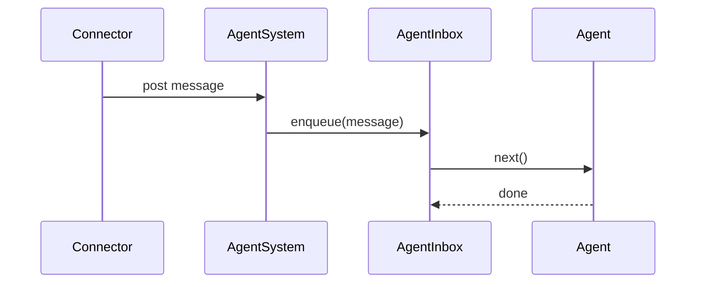
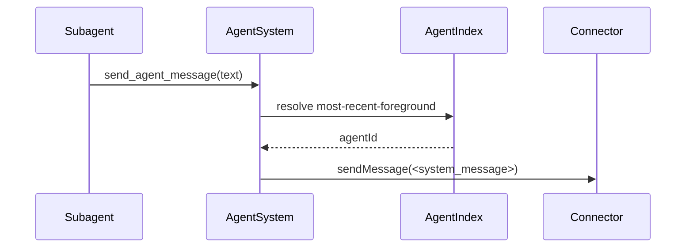
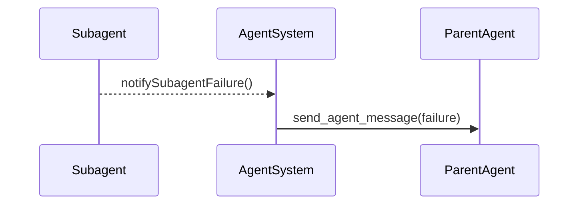
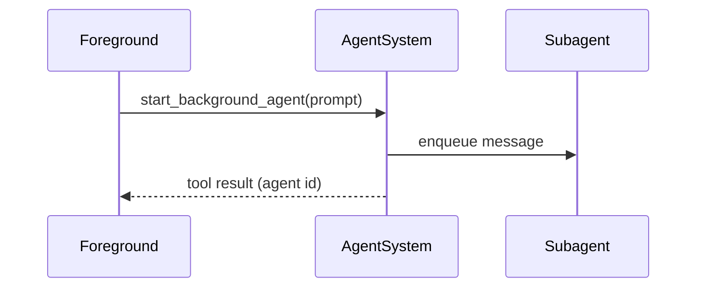

# Agents

Agents provide per-channel sequencing of messages, ensuring each agent is handled one message at a time.

## Agent routing rules
- Agent ids are cuid2 values mapped to `connector + channelId + userId`, cron task uid, or heartbeat.
- Connectors must provide `channelId` and `userId` for mapping.
- Messages (and files) are queued and processed in order via `AgentInbox`.

## System message routing
When `send_agent_message` omits a target agent id, the engine routes to the most recent
foreground user agent.

## Agent persistence
- Agents are written to `.claybot/agents/<cuid2>/` as discrete files.
- `descriptor.json` captures the agent type and identity.
- `state.json` stores provider selection, permissions, routing, and timestamps.
- `history.jsonl` stores minimal user/assistant/tool records.
- History is restored starting after the most recent `start` or `reset` marker.

## Model context reconstruction
History records are expanded into inference context on restore.

## Subagent failure notifications
Background agents emit a single failure notification to the parent agent.

## Background agent start
Starting a subagent enqueues work and returns immediately; the background agent continues processing asynchronously.

## Resetting agents
- Agents can be reset without changing the agent id.
- Reset clears the stored context messages and appends a `reset` marker in history.
- Connectors are responsible for handling reset commands; the engine does not interpret slash commands.

## Key types
- `AgentMessage` stores message, context, and timestamps.
- `AgentState` holds mutable per-agent state.
- `FileReference` links attachments in the file store.
