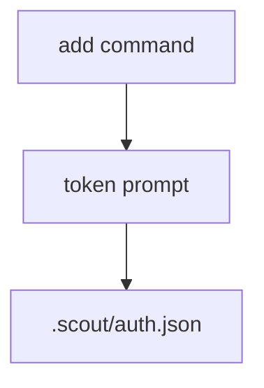

# Auth tokens

Scout stores connector and inference tokens in `.scout/auth.json`.

## Structure
```json
{
  "telegram": { "token": "..." },
  "codex": { "token": "..." },
  "claude-code": { "token": "..." },
  "inference": {
    "providers": [
      { "id": "claude-code", "model": "claude-3-5-sonnet-latest", "main": true },
      { "id": "codex", "model": "gpt-5.1-codex-mini" }
    ]
  }
}
```

## CLI helpers
- `scout add telegram` writes `auth.telegram.token`
- `scout add codex` writes `auth.codex.token` and appends a provider entry
- `scout add claude` writes `auth.claude-code.token` and appends a provider entry

Provider priority is defined by order in `auth.inference.providers`:
- Last added goes last (lowest priority).
- `--main` moves the provider to the front and clears `main` on others.



## Usage
- `start` reads `.scout/auth.json` to load telegram tokens and inference providers.
- `inference` helpers read `.scout/auth.json` when a token is not passed explicitly.
