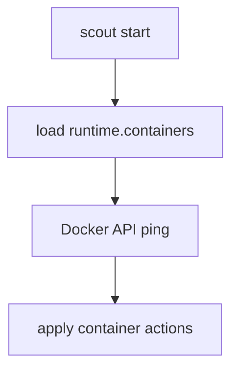

# Container runtime

Scout can manage container lifecycles through the Docker Engine API (no shell calls).

## Responsibilities
- Connect to Docker over the API (socket or TCP).
- Start/stop/restart containers or ensure they are running.



## Runtime config (excerpt)
```json
{
  "runtime": {
    "containers": {
      "connection": {
        "socketPath": "/var/run/docker.sock"
      },
      "containers": [
        { "name": "redis", "action": "ensure-running" },
        { "name": "worker", "action": "restart" }
      ]
    }
  }
}
```

Notes:
- `action` defaults to `ensure-running`.
- You can use `id` or `name` for each container.
- `stopTimeoutMs` controls graceful stop/restart timeouts.
