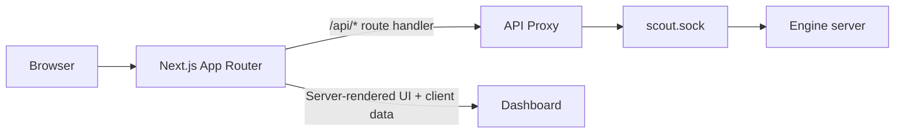
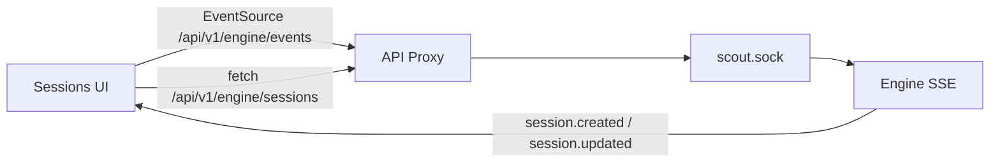
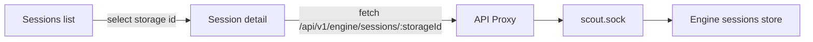
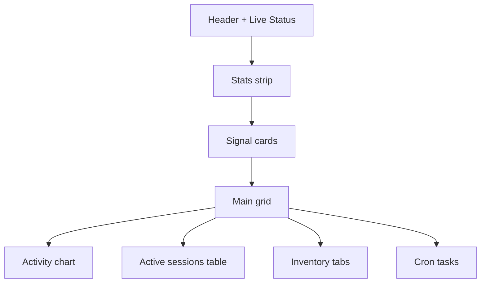
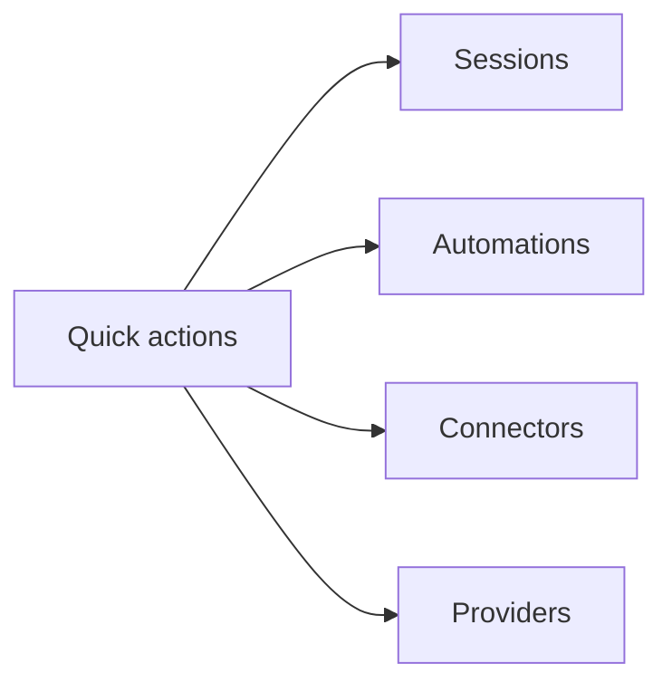
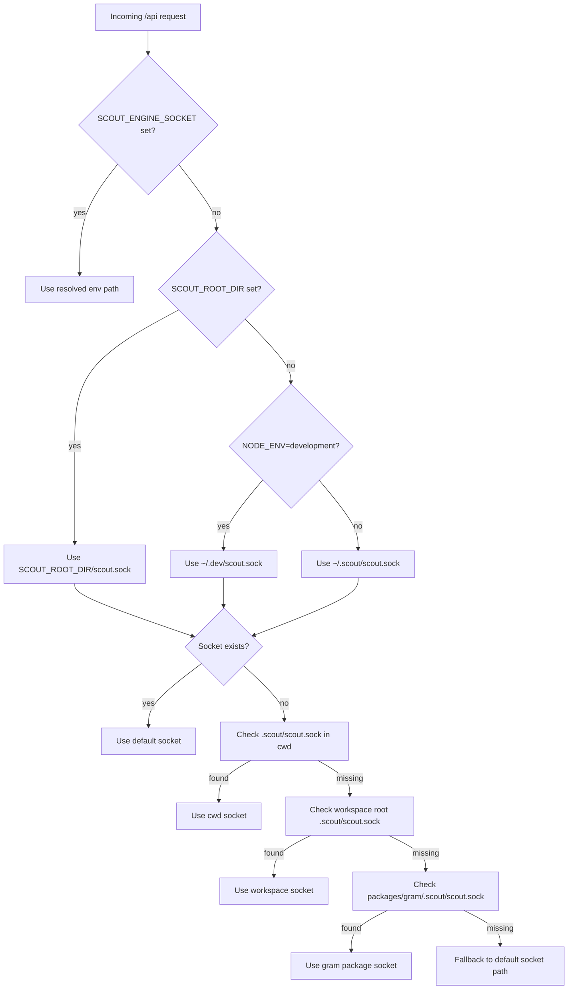

# Grambot dashboard

`gram-dashboard` is a Next.js app router UI styled with shadcn components.
API route handlers proxy `/api/*` requests to the local engine socket.

Default port: `7331` (set via `PORT` in the workspace scripts).

## Sessions streaming

The sessions views subscribe to the engine event stream and refresh session data when session events arrive.

## Session detail navigation

Session rows link to a dedicated detail page that loads the full log for that session.

## Overview layout

The overview page blends a stats strip, signal cards, and live panels.

## Quick actions

Action cards jump to the most used operational screens.

## Engine socket resolution

The dashboard proxy prefers an explicit socket override. If none is set, it resolves a default
scout root (SCOUT_ROOT_DIR, or `~/.dev` in development, or `~/.scout` otherwise) and then
falls back to common workspace locations.

