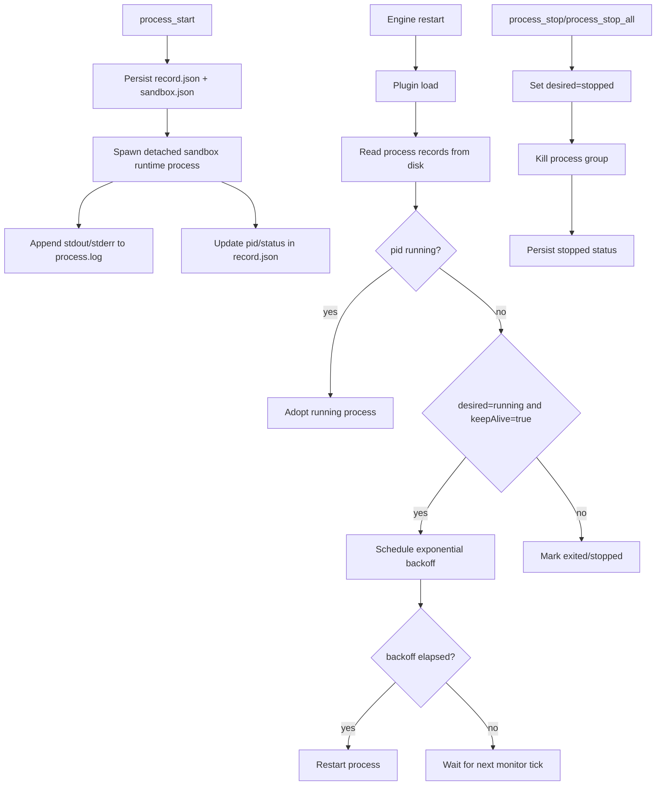

# Durable Process Manager

Daycare now includes durable shell process tools that behave like a lightweight process supervisor.

## Goals

- Start commands as detached managed processes.
- Persist process state (pid, desired state, restart policy) on disk.
- Rehydrate managed process state after engine restart.
- Allow explicit stop operations (`process_stop`, `process_stop_all`).
- Persist process logs for later inspection (`process_logs`).

## Storage Model

Managed process state is stored per process in plugin data:

- `processes/<id>/record.json`
- `processes/<id>/sandbox.json`
- `processes/<id>/process.log`

`record.json` is the source of truth for durable state, including:

- runtime pid (`pid`)
- desired state (`running` or `stopped`)
- observed status (`running`, `stopped`, `exited`)
- keep-alive flag and restart count
- restart backoff state (`restartFailureCount`, `nextRestartAt`)

## Runtime Flow

## Notes

- Keep-alive is opt-in per process via `process_start.keepAlive`.
- Keep-alive restarts use exponential backoff (2s base, doubling to 60s max) for crash loops.
- Stop operations apply to the full process group to terminate child processes.
- Log access reads tail bytes and returns content without requiring direct file access.
