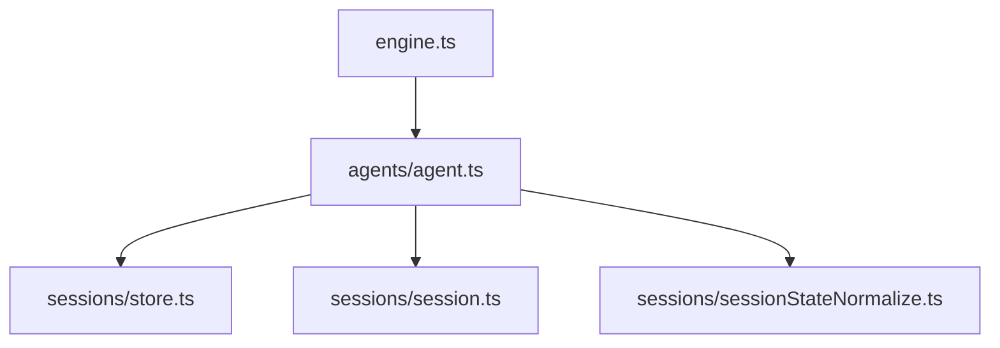

# Engine Agent Wrapper

Introduces a lightweight Agent that wraps a Session, loads/restores from JSONL logs, and enqueues messages with async persistence.

```mermaid
flowchart TD
  Engine[engine.ts] --> Agent[agents/agent.ts]
  Agent --> Store[sessions/store.ts]
  Agent --> Session[sessions/session.ts]
  Agent --> StateNorm[sessions/sessionStateNormalize.ts]
```
