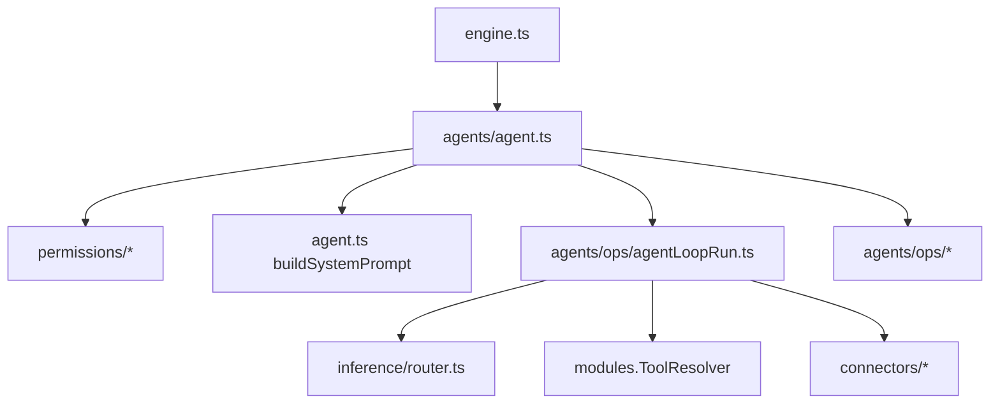
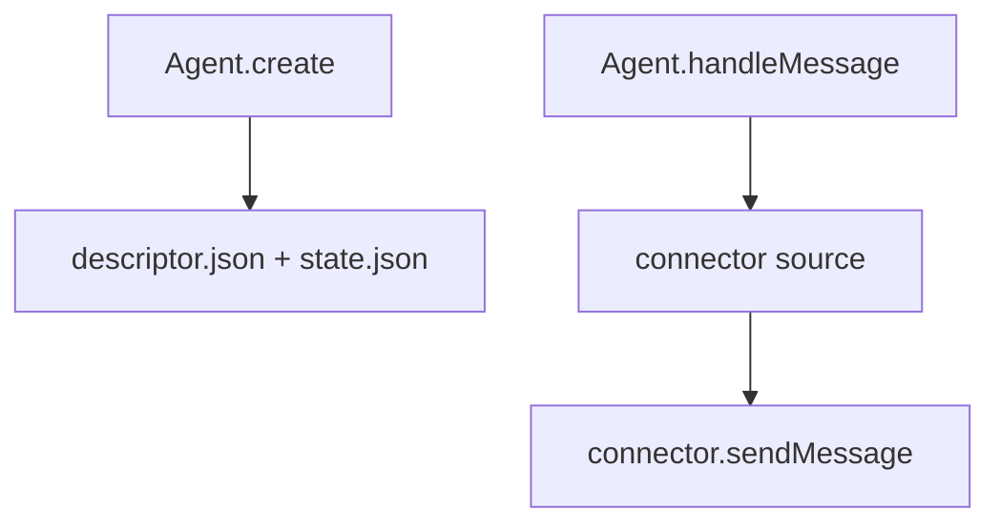

# Engine Agent Loop

The Agent owns the end-to-end agent loop:
- resolve permissions (cron/heartbeat)
- build the system prompt + tool context
- run the inference/tool loop
- persist state and emit outgoing events

## Agent Creation

Agent creation is deterministic and does not depend on inbound message context.
Message delivery uses the inbound connector source; system messages derive the connector
from the target agent descriptor.

