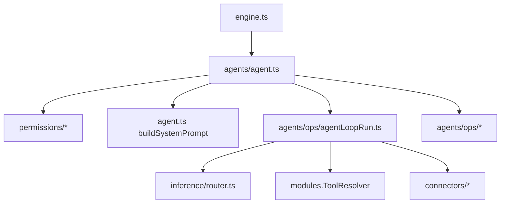

# Engine Agent Loop

The Agent owns the end-to-end agent loop:
- resolve permissions (cron/heartbeat)
- build the system prompt + tool context
- run the inference/tool loop
- persist state and emit outgoing events

