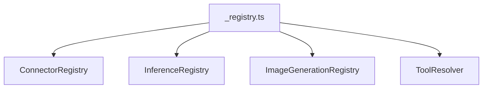

# Engine Modules Registry

The engine module registries now live under `sources/engine/modules/` and are exported through `_registry.ts` for shared imports.

```mermaid
flowchart TD
  Registry[_registry.ts]
  Connector[ConnectorRegistry]
  Inference[InferenceRegistry]
  Images[ImageGenerationRegistry]
  Tools[ToolResolver]

  Registry --> Connector
  Registry --> Inference
  Registry --> Images
  Registry --> Tools
```
