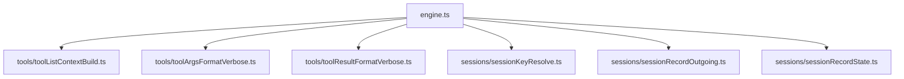

# Engine Tool and Session Extractions

Extracted tool list selection, verbose tool formatting, and session persistence helpers into dedicated modules.

```mermaid
flowchart TD
  Engine[engine.ts] --> ToolList[tools/toolListContextBuild.ts]
  Engine --> ToolArgs[tools/toolArgsFormatVerbose.ts]
  Engine --> ToolResult[tools/toolResultFormatVerbose.ts]
  Engine --> SessionKey[sessions/sessionKeyResolve.ts]
  Engine --> SessionOutgoing[sessions/sessionRecordOutgoing.ts]
  Engine --> SessionState[sessions/sessionRecordState.ts]
```
