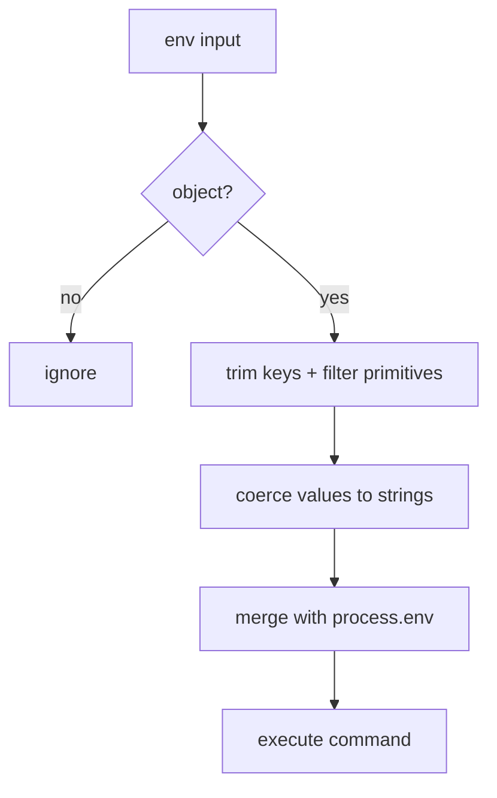

# Exec Environment Variables

`exec` and exec gates accept an optional `env` map to inject environment variables into the
command runtime. Keys are trimmed and blank keys are ignored. Values accept strings,
numbers, or booleans and are coerced to strings before execution. The final environment
is built by merging the normalized overrides onto `process.env`.

Example:
```json
{
  "command": "node scripts/check.js",
  "env": {
    "NODE_ENV": "production",
    "PORT": 3000,
    "VERBOSE": true
  }
}
```


