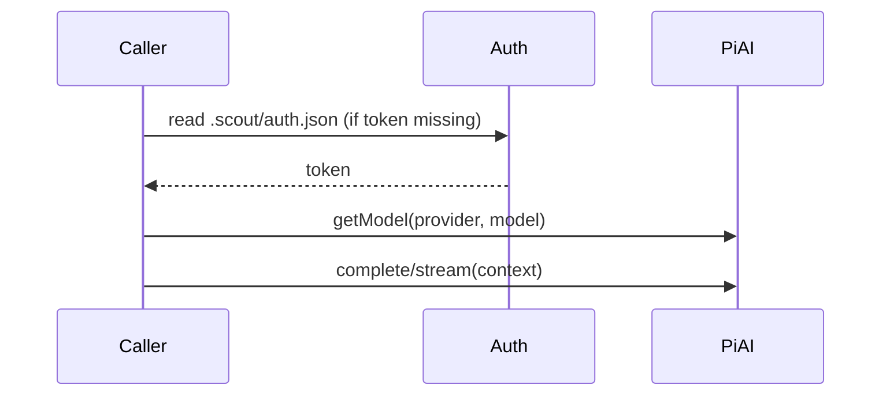

# Inference runtime

Scout ships an inference helper for Codex and Claude Code via `@mariozechner/pi-ai`.

## Exports
- `connectCodex({ model, token? })`
- `connectClaudeCode({ model, token? })`

Each returns an `InferenceClient` with:
- `complete(context, options?)`
- `stream(context, options?)`

## Provider priority
Inference providers are read from `.scout/auth.json` under `inference.providers`.
Order is preserved (last added is last), with `main: true` moved to the front.

When handling a session message:
- Scout tries providers in priority order.
- It only falls back if a provider fails before inference starts (e.g., missing token or invalid model).
- If inference has already started and fails, Scout stops and reports the error.

