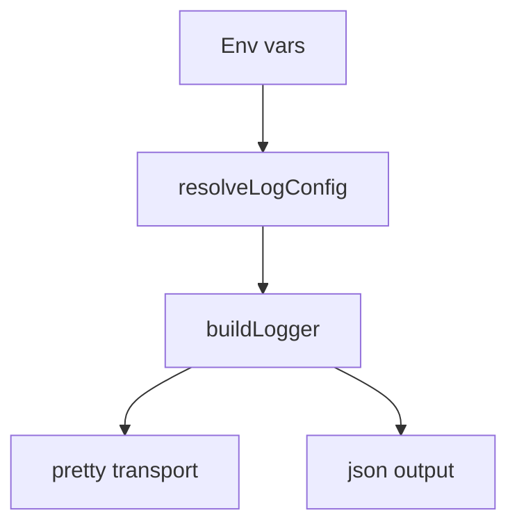

# Logging

Logging is centralized in `sources/log.ts` and uses Pino.

## Configuration
Environment variables:
- `SCOUT_LOG_LEVEL` / `LOG_LEVEL`
- `SCOUT_LOG_FORMAT` / `LOG_FORMAT` (`pretty` or `json`)
- `SCOUT_LOG_DEST` / `LOG_DEST` (`stdout`, `stderr`, or file path)
- `SCOUT_LOG_REDACT` (comma-separated paths)

Defaults:
- `pretty` format in TTY + non-production
- `json` otherwise
- redaction for `token`, `password`, `secret`, `apiKey` and dotted variants



## Verbose Logging

The codebase includes extensive verbose logging at the `debug` level. To enable verbose logging for deep visibility into server operations, set:

```bash
SCOUT_LOG_LEVEL=debug yarn dev
```

### Verbose Log Components

Verbose logs are prefixed with `[VERBOSE]` for easy filtering and include:

| Component | Scope | What it logs |
|-----------|-------|--------------|
| Engine | `engine.runtime` | Message processing flow, inference loop, tool execution, session lifecycle |
| Inference Router | `inference.router` | Provider selection, fallback attempts, client creation, completion calls |
| Plugin Manager | `plugins.manager` | Plugin load/unload, settings sync, module loading |
| Plugin Events | `plugins.events` | Event dispatch, handler registration |
| Session Manager | `sessions.manager` | Session creation, message queue, processing state |
| Provider Manager | `providers.manager` | Provider sync, load/unload |
| Connectors | `connectors.registry` | Connector registration, message handling |
| Inference Registry | `inference.registry` | Provider registration |
| Image Registry | `image.registry` | Image provider registration |
| Tool Resolver | `engine.modules` | Tool registration, execution, validation |
| Cron Scheduler | `cron.scheduler` | Task scheduling, dispatch |
| Telegram | `connector.telegram` | Polling, message send/receive, file handling |
| IPC Server | `engine.server` | API requests, SSE connections |

### Example: Debug Message Flow

```bash
# Enable verbose logging
SCOUT_LOG_LEVEL=debug yarn dev
```

Example output tracing a message:
```
[VERBOSE] Received Telegram message { chatId: 123, messageId: 456 }
[VERBOSE] ConnectorRegistry.onMessage received { source: "telegram", channelId: "123" }
[VERBOSE] PluginEventEngine handling connector.message event
[VERBOSE] SessionManager.handleMessage() called
[VERBOSE] Creating new session { sessionId: "telegram:123" }
[VERBOSE] handleSessionMessage started { sessionId: "...", hasText: true }
[VERBOSE] Inference loop iteration { iteration: 0 }
[VERBOSE] Trying provider { providerId: "anthropic", model: "claude-sonnet-4-20250514" }
[VERBOSE] Creating inference client
[VERBOSE] Calling client.complete()
[VERBOSE] Inference completed successfully { stopReason: "end_turn", inputTokens: 50, outputTokens: 100 }
[VERBOSE] No tool calls, breaking inference loop
[VERBOSE] Sending response to user { textLength: 200 }
[VERBOSE] Response sent successfully
[VERBOSE] handleSessionMessage completed successfully
```

### Filtering Verbose Logs

To filter only verbose logs:
```bash
SCOUT_LOG_LEVEL=debug yarn dev 2>&1 | grep "\[VERBOSE\]"
```

To filter by component:
```bash
SCOUT_LOG_LEVEL=debug yarn dev 2>&1 | grep "inference.router"
```
