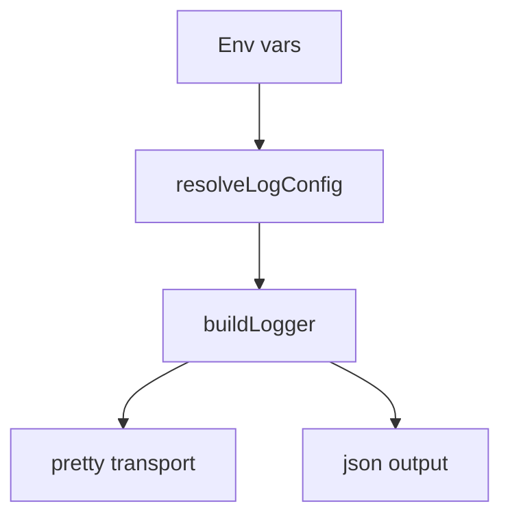

# Logging

Logging is centralized in `sources/log.ts` and uses Pino.

## Configuration
Environment variables:
- `CLAYBOT_LOG_LEVEL` / `LOG_LEVEL`
- `CLAYBOT_LOG_FORMAT` / `LOG_FORMAT` (`pretty` or `json`)
- `CLAYBOT_LOG_DEST` / `LOG_DEST` (`stdout`, `stderr`, or file path)
- `CLAYBOT_LOG_REDACT` (comma-separated paths)

Defaults:
- `debug` level in development, `info` in production
- `pretty` format in TTY + non-production
- `json` otherwise
- redaction for `token`, `password`, `secret`, `apiKey` and dotted variants

## Pretty Output

Pretty output uses a fixed-width module label and time-only prefix:

```
[HH:MM:ss] [module     ] message text
```

- Module labels are trimmed/padded to 10 characters.
- Plugin modules use the `plugin.` prefix and render as `(module     )`.
- Missing module values render as `unknown`.



## Verbose Logging

The codebase includes extensive verbose logging at the `debug` level. Debug logging is enabled by default in development mode (`yarn dev`).

To disable verbose logging in dev mode:
```bash
CLAYBOT_LOG_LEVEL=info yarn dev
```

### Verbose Log Components

Debug logs include key data embedded in the message text using `key=value` format:

| Component | Module | What it logs |
|-----------|-------|--------------|
| Engine | `engine.runtime` | Message processing flow, inference loop, tool execution, session lifecycle |
| Inference Router | `inference.router` | Provider selection, fallback attempts, client creation, completion calls |
| Plugin Manager | `plugins.manager` | Plugin load/unload, settings sync, module loading |
| Plugin Events | `plugins.events` | Event dispatch, handler registration |
| Session Manager | `sessions.manager` | Session creation, message queue, processing state |
| Provider Manager | `providers.manager` | Provider sync, load/unload |
| Connectors | `connectors.registry` | Connector registration, message handling |
| Inference Registry | `inference.registry` | Provider registration |
| Image Registry | `image.registry` | Image provider registration |
| Tool Resolver | `engine.modules` | Tool registration, execution, validation |
| Cron Scheduler | `cron.scheduler` | Task scheduling, dispatch |
| Telegram | `connector.telegram` | Polling, message send/receive, file handling |
| IPC Server | `engine.server` | API requests, SSE connections |

### Example: Debug Message Flow

```bash
# Debug logging is enabled by default in dev mode
yarn dev
```

Example output tracing a message:
```
[09:41:12] (telegram  ) Received Telegram message chatId=123 messageId=456
[09:41:12] (telegram  ) Dispatching to handlers handlerCount=1 channelId=123
[09:41:12] [engine.run] Handling connector.message event
[09:41:12] [sessions.m] handleMessage() called source=telegram channelId=123 hasText=true fileCount=0
[09:41:12] [sessions.m] Creating new session sessionId=anthropic:user-123
[09:41:12] [engine.run] handleSessionMessage started sessionId=anthropic:user-123 messageId=abc hasText=true textLength=15 fileCount=0
[09:41:12] [engine.run] Inference loop iteration=0 sessionId=anthropic:user-123 messageCount=1
[09:41:12] [inference.] Trying provider providerIndex=0 providerId=anthropic model=claude-sonnet-4-20250514
[09:41:12] [inference.] Creating inference client providerId=anthropic model=claude-sonnet-4-20250514
[09:41:12] [inference.] Calling client.complete() providerId=anthropic modelId=claude-sonnet-4-20250514 sessionId=anthropic:user-123
[09:41:12] [inference.] Inference completed successfully providerId=anthropic modelId=claude-sonnet-4-20250514 stopReason=end_turn contentBlocks=1 inputTokens=50 outputTokens=100
[09:41:12] [engine.mod] Extracted tool calls from response toolCallCount=0
[09:41:12] [engine.run] No tool calls, breaking inference loop iteration=0
[09:41:12] (telegram  ) Sending response to user textLength=200 fileCount=0 channelId=123
[09:41:12] (telegram  ) Response sent successfully
[09:41:12] [engine.run] handleSessionMessage completed successfully
```

### Filtering Logs

To filter by module label:
```bash
CLAYBOT_LOG_LEVEL=debug yarn dev 2>&1 | grep -F "[inference.]"
```

To filter by specific key:
```bash
CLAYBOT_LOG_LEVEL=debug yarn dev 2>&1 | grep "sessionId="
```
