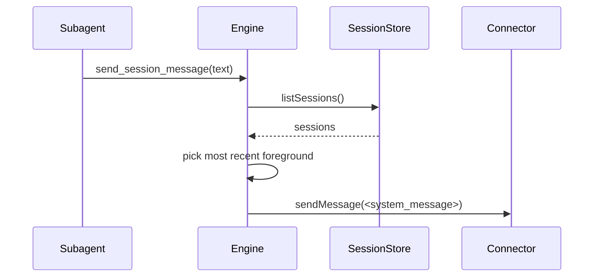

# Sessions

Sessions provide per-channel sequencing of messages, ensuring each session is handled one message at a time.

## Session rules
- Session ids are cuid2 values mapped to `connector + channelId + userId`.
- Connectors must provide `channelId` and `userId` for mapping.
- A connector or scheduler can override with `context.sessionId`.
- Messages (and files) are queued and processed in order.

## System message routing
When `send_session_message` omits a target session id, the engine routes to the most recent
foreground user session.

## Session persistence
- Sessions are written to `.claybot/sessions/<cuid2>.jsonl` as append-only logs.
- Entries include `session_created`, `incoming`, `outgoing`, and `state` snapshots.
- `incoming`/`outgoing` entries now store `files` when present.

## Resetting sessions
- Sessions can be reset without changing the session id.
- Reset clears the stored context messages but keeps the provider binding intact.

## Key types
- `SessionMessage` stores message, context, and timestamps.
- `SessionContext` holds mutable per-session state.
- `FileReference` links attachments in the file store.
