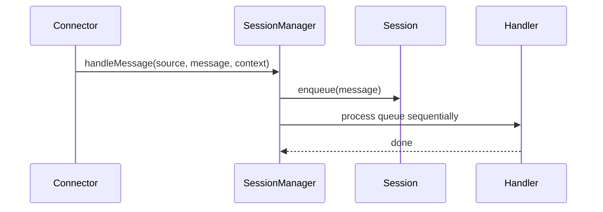

# Sessions

Sessions provide per-channel sequencing of messages, ensuring each session is handled one message at a time.

## Session rules
- Session id defaults to `${source}:${channelId}`.
- A connector can override with `context.sessionId`.
- Messages are queued and processed in order.

## Session logs
Scout emits session lifecycle logs during `start`:
- `Session created` when a new session is created.
- `Session updated` when a message is enqueued.
- `Session processing started` / `Session processing completed` around each message.
- `Inference started` / `Inference completed` (or `Inference failed`) when inference runs.

## Session persistence
- Sessions are written to `.scout/sessions/<cuid2>.jsonl` as append-only logs.
- Entries include `session_created`, `incoming`, `outgoing`, and `state` snapshots.
- On startup, scout restores sessions from disk. If the last logged entry was `incoming`,
  it sends an `Internal error.` reply to the channel to close out the pending message.

## Key types
- `SessionMessage` stores message, context, and timestamps.
- `SessionContext` holds mutable per-session state.
