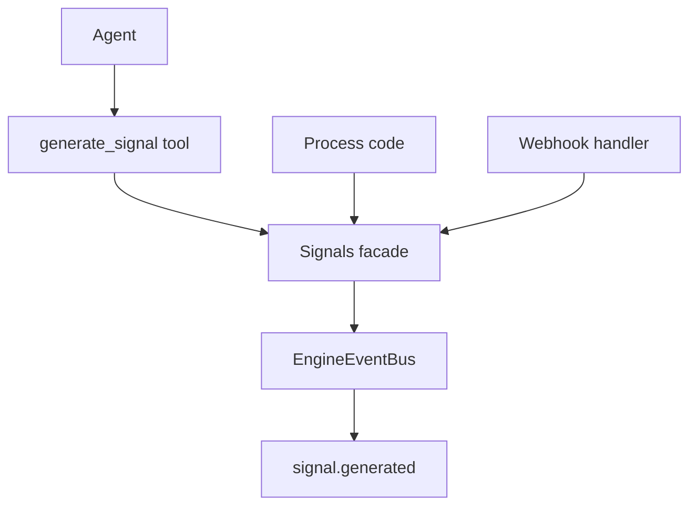

# Signals

Signals are lightweight runtime events with a distinct string `type`, an optional `data` payload, and a `source`.

Supported sources:
- `webhook`
- `agent`
- `process`

## Runtime model

`Engine` owns a `Signals` facade (`sources/engine/signals/signals.ts`).
`Signals.generate()` creates a signal object and emits `signal.generated` on the engine event bus.

Signal shape:
- `id` (cuid2)
- `type` (string id)
- `source` (`webhook | agent | process`)
- `data` (optional)
- `agentId` (optional, set for agent-generated signals)
- `createdAt` (unix timestamp in milliseconds)

## Tool

The core tool `generate_signal` is registered for agent contexts.

Arguments:
- `type` (required string)
- `source` (optional, defaults to `agent` in tool usage)
- `data` (optional payload)

When used by an agent, `agentId` is attached when source is `agent`.
