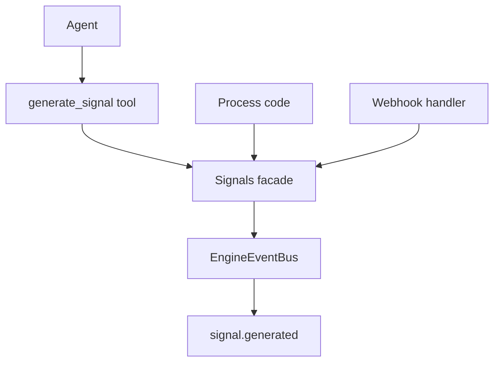

# Signals

Signals are lightweight runtime events with a distinct string `type`, an optional `data` payload, and a structured `source`.

Supported source variants:
- `{ type: "system" }`
- `{ type: "agent", id: string }`
- `{ type: "webhook", id?: string }`
- `{ type: "process", id?: string }`

## Runtime model

`Engine` owns a `Signals` facade (`sources/engine/signals/signals.ts`).
`Signals.generate()` creates a signal object and emits `signal.generated` on the engine event bus.

Signal shape:
- `id` (cuid2)
- `type` (string id)
- `source` (discriminated object union)
- `data` (optional)
- `createdAt` (unix timestamp in milliseconds)

## Tool

The core tool `generate_signal` is registered for agent contexts.

Arguments:
- `type` (required string)
- `source` (optional object; defaults to `{ type: "agent", id: <current-agent-id> }` in tool usage)
- `data` (optional payload)
