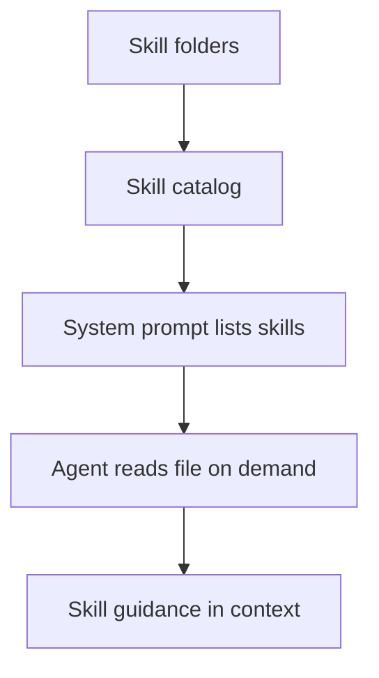

# Skills

Skills are opt-in prompts stored as files on disk. They are **not** loaded into
the system prompt automatically. The agent loads a skill on demand by reading
the file path listed in the system prompt.

## Where skills live

ClayBot discovers skills in two places:
- `.claybot/skills/` (local, user-managed skills)
- `packages/claybot/sources/plugins/<plugin-id>/skills/` (plugin-provided skills)

Each skill is a single `.md` file. The file name becomes the skill name shown
to the agent. The system prompt includes the **absolute path** to each skill so
the agent can read it directly.

## Loading and unloading

- **Load**: read the skill file from disk.
- **Reload**: read the file again if it has changed.
- **Unload**: explicitly ignore the skill's guidance moving forward.

