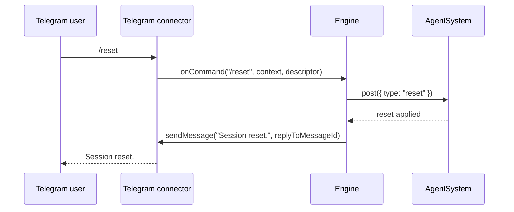

# Telegram reset command confirmation

This note documents the `/reset` command flow when received from Telegram.

## Notes
- The reset command still clears session context with the same reset message payload.
- After reset is posted, Engine sends a direct connector response: `Session reset.`.
- The response keeps conversational threading by setting `replyToMessageId` from command context.
